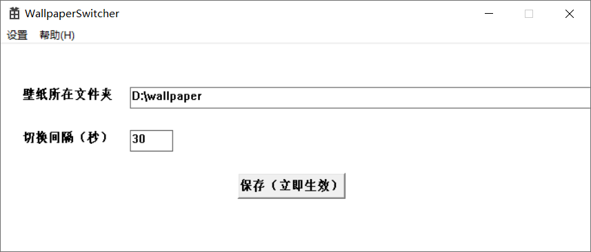
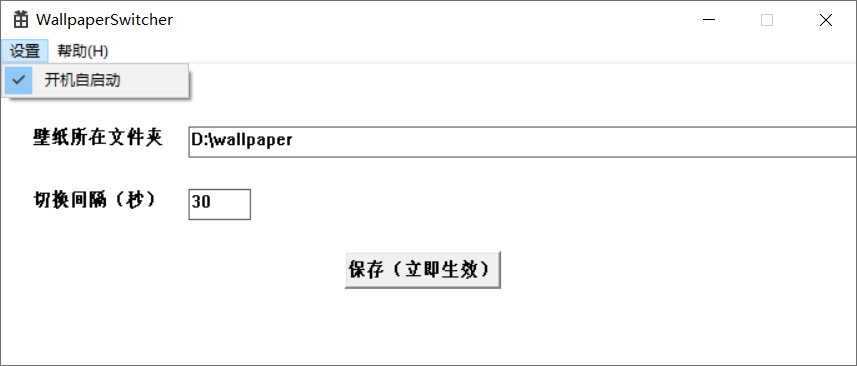

# WallpaperSwicher
一个从指定文件夹中获得壁纸并自动定时切换的小工具，使用C++和Windows API编写，有一个简洁（粗制滥造）的窗口。

如果你也有兴趣的话欢迎联系我一起开发（发个issue告知就好）。

# 概况

开发语言：C++

IDE：Microsoft Visual Studio 2019

界面开发技术：Windows API

壁纸切换策略：随机切换（后期将会加入更多策略，保证让切换看起来更“随机”）（目前的想法是参考操作系统中的页面置换算法的策略）

# 如何使用
使用Microsoft Visual Studio 2019（2017应该问题也不大，更低的版本就不清楚了）打开项目根目录的"WallpaperSwitcher.sln"进行修改编译；
或[直接下载](https://github.com/ADD-SP/WallpaperSwitcher/releases)

> ALT + ~ 立即切换到下一张壁纸

> ALT + 2 隐藏软件界面

> ALT + 1 显示软件界面

> ALT + F1 关闭软件

**P S：目前还没有增加自启动功能，如果需要可以自行将软件的快捷方式拷贝到“C:\ProgramData\Microsoft\Windows\Start Menu\Programs\StartUp”目录下，而软件本身则可以放置到任意位置**

# 目录结构
直接用Microsoft Visual Studio 2019（2017应该问题也不大，更低的版本就不清楚了）打开就好，不需要目录结构说明

# 使用截图

# 瞎扯
作者一直在用Steam上的Wallpaper Engine，这个软件非常好用，但是也遇到一点问题：

1. 我个人比较喜欢多张壁纸轮流作为桌面而不是单一的壁纸。
2. 下载了一些Wallpaper Engine上的作品，起初感觉还不错。
3. 时间久了就有一些问题。
4. 虽然Wallpaper Engine上的作品中用于轮换的壁纸数量很多，但经常看到的都是那么几张，很多壁纸都没有见过。
5. 例如一个有500张用于轮换的壁纸，但是通常可以被作为桌面的只有前几十张，后面的全部用不到。
6. 我曾经尝试修改Wallpaper Engine上的作品中的配置使得壁纸轮换规则由顺序选择壁纸轮换改为随机选择壁纸轮换。
7. 效果不大，还是看到很多重复的。
8. 尝试在作品中加入一些较为复杂的策略均衡每张图片出现的次数（尝试了操作系统中的页面置换算法的策略）。
9. 用JS写这种东西太痛苦了，而且还需要修改Wallpaper Engine上的作品的不少地方的代码，容易出问题；。
9. 干脆自己写一个。
10. 顺带搞一下自己大一就想搞得Windows API，来一次Windows API编程。

# 更新日志

## 2019/11/17
+ 修复了重启后配置丢失BUG，更改了快捷键，在不是第一次打开的时候自动隐藏窗口；

