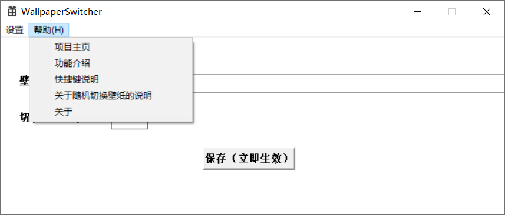
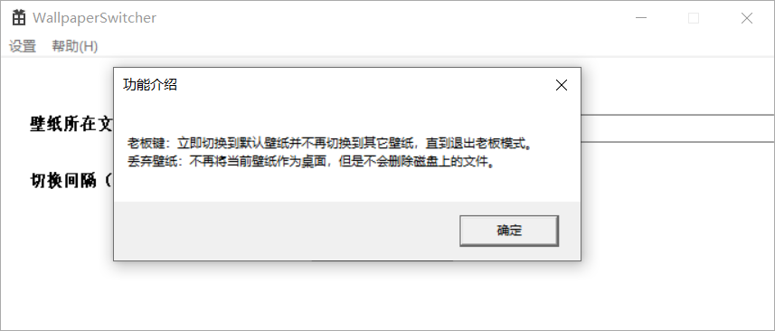
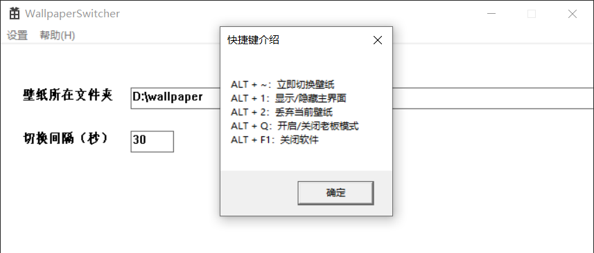
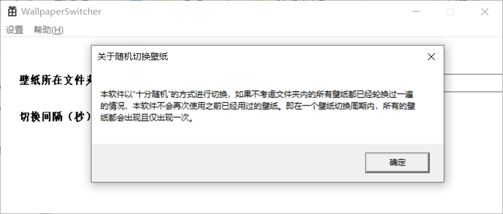
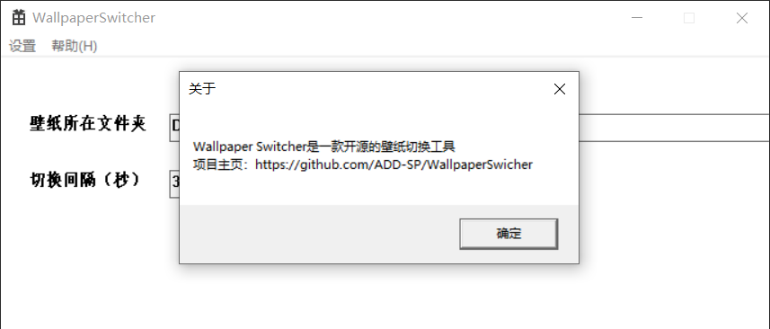
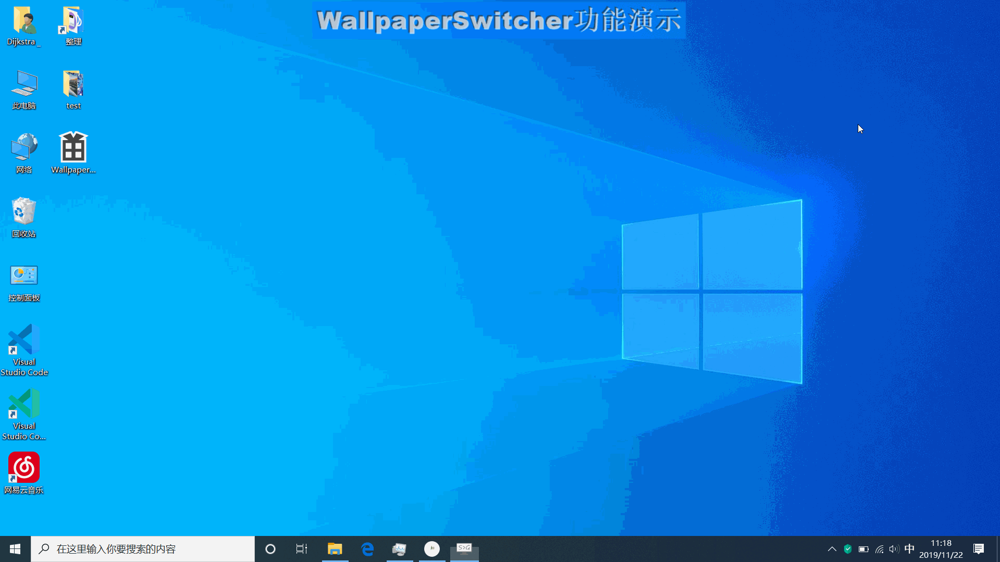
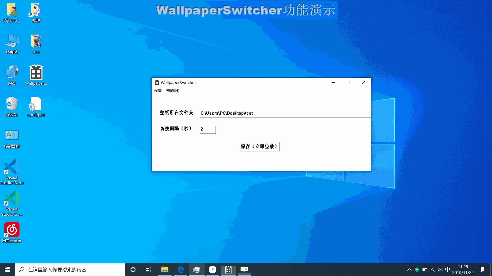

# WallpaperSwicher
一个可以将文件夹的的图片轮流设置为壁纸的工具，支持随机切换壁纸、使用快捷键切换壁纸，老板模式，丢弃当前壁纸（不再使用该壁纸）等；

如果你也有兴趣的话欢迎联系我一起开发（可以发个issue表明一下意愿）。

# 概况

开发语言：C++

IDE：Microsoft Visual Studio 2019

界面开发技术：Windows API

壁纸切换策略：以“十分随机”的方式进行切换，如果不考虑文件夹内的所有壁纸都已经轮换过一遍的情况，本软件不会再次使用之前已经用过的壁纸。即在一个壁纸切换周期内，所有的壁纸都会出现且仅出现一次。

# 如何使用
使用Microsoft Visual Studio 2019（2017应该问题也不大，更低的版本就不清楚了）打开项目根目录的"WallpaperSwitcher.sln"进行修改编译；
或[直接下载](https://github.com/ADD-SP/WallpaperSwitcher/releases)

> 【ALT + ~ 】  立即切换到下一张壁纸

> 【ALT + 1】   显示/隐藏软件界面

> 【ALT + 2】   弃用该壁纸，即不再使用该壁纸作为桌面，但是不删除磁盘上的文件

> 【ALT + Q】   立即切换为Windows默认壁纸，不再切换壁纸，直到本快捷键再次按下。这个功能的用处大概就是你的壁纸不想被人看到的时候提前按一下快捷键再回桌面；

> 【ALT + F1】  关闭软件

# 目录结构
直接用Microsoft Visual Studio 2019（2017应该问题也不大，更低的版本就不清楚了）打开就好，不需要目录结构说明

# 使用截图

## 初始配置演示

## 自动切换演示

## 快捷键切换演示

# 瞎扯
作者一直在用Steam上的Wallpaper Engine，这个软件非常好用，但是也遇到一点问题：

1. 我个人比较喜欢多张壁纸轮流作为桌面而不是单一的壁纸。
2. 下载了一些Wallpaper Engine上的作品，起初感觉还不错。
3. 时间久了就有一些问题。
4. 虽然Wallpaper Engine上的作品中用于轮换的壁纸数量很多，但经常看到的都是那么几张，很多壁纸都没有见过。
5. 例如一个有500张用于轮换的壁纸，但是通常可以被作为桌面的只有前几十张，后面的全部用不到。
6. 我曾经尝试修改Wallpaper Engine上的作品中的配置使得壁纸轮换规则由顺序选择壁纸轮换改为随机选择壁纸轮换。
7. 效果不大，还是看到很多重复的。
8. 尝试在作品中加入一些较为复杂的策略均衡每张图片出现的次数（尝试了操作系统中的页面置换算法的策略）。
9. 用JS写这种东西太痛苦了，而且还需要修改Wallpaper Engine上的作品的不少地方的代码，容易出问题；。
9. 干脆自己写一个。
10. 顺带搞一下自己大一就想搞得Windows API，来一次Windows API编程。

# 更新日志

## 2019/11/22
+ 现在可以防止重复运行本软件了；

## 2019/11/20

### 功能性更新
+ 支持设置开机启动，可在顶部菜单栏中设置；

+ 采用了”十分随机“的壁纸切换策略，如果不考虑文件夹内的所有壁纸都已经轮换过一遍的情况，本软件不会再次使用之前已经用过的壁纸。即在一个壁纸切换周期内，所有的壁纸都会出现且仅出现一次。

+ 主窗口顶部菜单栏更新，新增选项”开机自启动“、”项目主页“、”功能介绍“、”快捷键介绍“、”关于随机切换壁纸“和”关于“；
### BUG修复
+ 修复了在老板模式下依旧可以通过【ALT + ~】快捷键切换壁纸的BUG

## 2019/11/18
+ **本次更新需要删除程序所在目录的”config.ini“文件，否则程序首次运行会出错，当然也可以忽视错误重新设置壁纸路径和时间，后续也不会有任何问题；**

+ 新增了丢弃当前壁纸的功能，快捷键ALT + Q，被丢弃的壁纸不会再作为桌面；如果你不喜欢当前壁纸的话可以用这个功能；

+ 新增了类似“老板键“的功能，快捷键ALT + 2，会立即切换到Windows默认壁纸，并且在此期间不会更换成其他壁纸，直到再次摁下ALT + 2；

+ 现在在使用快捷键切换壁纸后壁纸切换定时会重置；

## 2019/11/17
+ 修复了重启后配置丢失BUG，更改了快捷键，在不是第一次打开的时候自动隐藏窗口；

